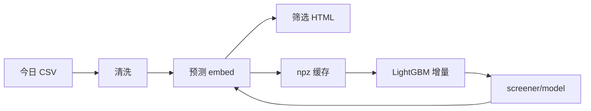

# temu-resnet-EXE

Temu 厨房收纳选品的 **Windows CPU 便携版**：ResNet18 主图向量 + BGE 标题向量 + LightGBM 排序，图形界面一键生成可删改筛选 HTML。

- **本仓库为 CPU 版**（PyTorch CPU，无 CUDA），适合无独显或希望安装包更小的环境。
- 业务同事操作说明：[README_用户版.md](README_用户版.md)
- 与 CUDA 版的差异与重装依赖：[README_CPU版.md](README_CPU版.md)

## 功能概览

| 能力 | 说明 |
|------|------|
| 日更导入 | 多 CSV/XLSX 合并、清洗、违禁词过滤 |
| 预测排序 | 在昨日模型上对今日商品打分（`预测分` 为 log1p 销量尺度，用于相对排序） |
| 增量训练 | 今日 HTML 生成后，用今日数据 **warm start** 训练明日模型 |
| 主图管线 | 异步批量下载 → ResNet18 图像向量 → 可选视觉去重 |
| 交付物 | 浏览器内删卡片、保存筛选结果；基础数据分析 HTML |

有昨日模型时的日更流程：

1. **先预测**（下载 + 向量化一次）
2. 向量写入 `data_store/npz`，**增量训练跳过重复下载 / ResNet / BGE**
3. 训练后 **保留** `image_cache` 与 `npz`，避免次日重复下载与 embedding

CPU 上 ResNet/BGE 会比 GPU 慢，日志中有 `[embed] img x/y` 进度条。

## 快速开始

### 仓库里有什么

Git 包含 **源码 + 模型 bundle**（`screener/model/`）。**不包含** `runtime/`（嵌入式 Python、PyTorch、离线 BGE，约 1GB+），需在发布包中单独附带或按下方命令自建。

### 启动

双击 **`模型训练.bat`**：

```bat
runtime\base-python\Scripts\python.exe KitchenApp.py
```

### 每日操作

1. 选择今日导出表文件夹 → 多选文件 → **生成今日筛选 HTML**
2. 浏览器删卡片 → **保存筛选后 HTML**
3. 可选：**数据分析**、**清空模型缓存**

命令行：

```bat
runtime\base-python\Scripts\python.exe pipeline\daily.py --today 你的表.csv
```

### 自建 CPU runtime（维护）

```bat
runtime\base-python\Scripts\python.exe -m pip install torch torchvision --index-url https://download.pytorch.org/whl/cpu
runtime\base-python\Scripts\python.exe -m pip install -r screener\requirements.txt scikit-learn
```

首次运行前复制 `screener/config.json.example` 为 `screener/config.json`（日更也会自动写入相对路径配置）。

## 目录结构

```
KitchenApp.py
模型训练.bat
pipeline/          # daily.py 日更编排、训练
screener/          # 预测、HTML、embed
  model/           # LightGBM bundle
words/
data_store/        # 运行时数据（gitignore）
runtime/           # 便携 Python（gitignore）
```

## 架构



## 环境变量

| 变量 | 默认 |
|------|------|
| `KITCHEN_DATA_STORE` | `data_store` |
| `HF_HOME` | `runtime/hf-cache` |

## 许可与合规

勿提交 `portable_config.json` 与个人 `screener/config.json`。选品结果仅供内部决策，请遵守平台与数据合规要求。

**仓库**：[github.com/Spacexist/temu-resnet-EXE](https://github.com/Spacexist/temu-resnet-EXE)
